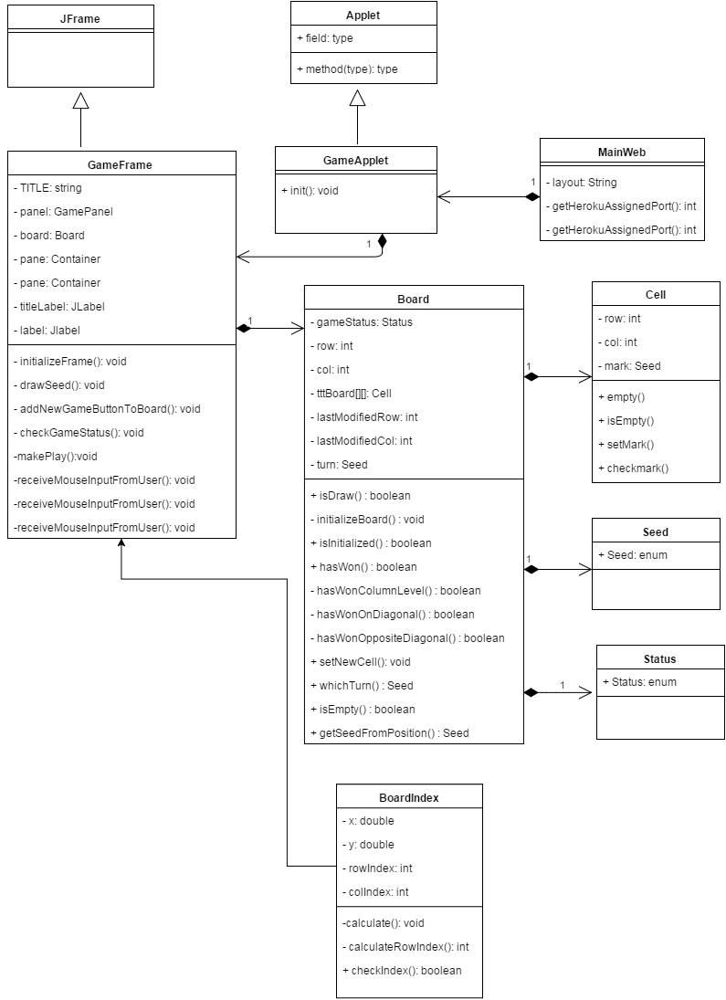

# Design report
## TicTacToe 
TicTacToe (also known as Noughts and crosses or Xs and Os) is a game for two players, X and O, who take turns marking the spaces in a 3×3 grid. The player who succeeds in placing three of their marks in a horizontal, vertical, or diagonal row wins the game.

## Short version design description
The game was designed as an graphical Java applet. 
The frame is in Html and is rendered with velocityTemplateEngine, and the applet itself is embedded in standard .jar. The user input comes from the mouse click. 

## Coding conventions

1. Java
* Brackets: public void func() {

            // code here
            }
            
2. Pascal
* Classes
3. Lower Camel Case
* Variables
* Functions

## Class diagram

